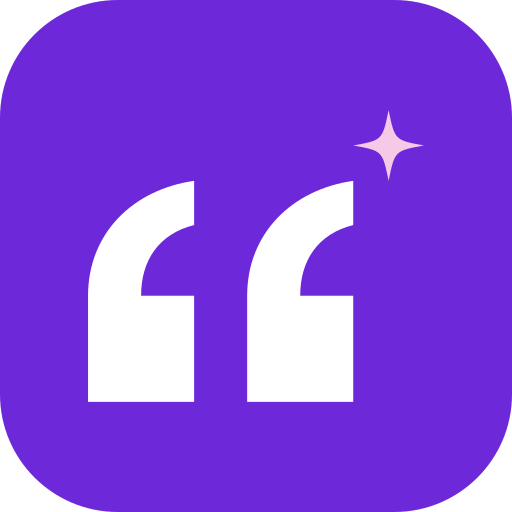

<p align="center">
  
</p>

# VoiceMoat MCP server

The personal brand OS for Twitter/X and LinkedIn: score, improve, schedule and
publish posts, from Claude, ChatGPT, Grok, Claude Code or any assistant that
supports remote MCP servers with OAuth.

**This repository holds documentation and connection settings only.** The
server is a hosted service run by VoiceMoat at the address below. Its source
code is not public, and there is nothing here to run. `plugin.json` and
`mcp.json` follow the [Agent Plugins](https://open-plugins.com) standard and
only point a client at that address.

```
https://app.voicemoat.com/api/mcp
```

| | |
|---|---|
| Transport | Streamable HTTP (remote, hosted) |
| Authentication | OAuth. Your assistant opens the VoiceMoat sign-in page. No API keys |
| Requires | A VoiceMoat account on the **Pro** or **Enterprise** plan |
| Website | https://voicemoat.com/mcp |
| Full setup guide | https://docs.voicemoat.com/connect-voicemoat-to-an-assistant |
| Official MCP Registry | `com.voicemoat/voicemoat` |

Connecting works on any plan. If your plan does not include it, each tool
refuses with an explanation, and it starts working when you move to Pro or
Enterprise, without reconnecting.

## What it does

- Score a draft against your voice profile, built from your own published posts
  and kept separately for each platform: a Voice Match score from 0 to 100 and a
  note on what is off.
- Improve a draft you already have.
- Get post ideas and opening lines.
- Read your voice profile, your impressions and reactions, and your top posts
  for the last 30 days.
- Publish a post now or schedule it, on Twitter or LinkedIn.

You do not call tools by name. You ask for what you want and the assistant picks.

## Connect it

**Claude**

1. Open **Settings**, then **Connectors**.
2. Choose **Add custom connector**.
3. Name it VoiceMoat and paste the address above.
4. Select **Connect** and sign in to VoiceMoat.

**ChatGPT**

Until VoiceMoat is listed in ChatGPT's plugin directory, add it with developer
mode. Whether you can turn developer mode on depends on your ChatGPT account and
workspace.

1. Open **Settings**, then **Security and login**, and turn on **Developer mode**.
2. Open **Plugins** and select the plus button.
3. Name it VoiceMoat, paste the address under **Connection**, and create it.
4. Sign in to VoiceMoat when asked.

**Grok**

1. Open grok.com/connectors.
2. Choose **New Connector**, then **Custom**.
3. Paste the address.
4. Sign in to VoiceMoat when asked.

**Claude Code**

```
claude mcp add -t http voicemoat https://app.voicemoat.com/api/mcp
```

Then type `/mcp` to sign in.

**Cline**

1. In the Cline panel, select the wrench icon, then the **MCP** tab.
2. Choose **Add Remote Server**, name it VoiceMoat and paste the address above.
3. Sign in to VoiceMoat in the browser window Cline opens. Once connected,
   VoiceMoat shows a green dot and its 15 tools.

**Other clients**

Any client that supports remote MCP servers over Streamable HTTP with OAuth can
connect with the same address. Nothing is shared until you sign in, and the
connection only ever reaches your own account.

## Tools (15)

| Tool | What it does | Read only | Posts |
|---|---|---|---|
| `get_me` | Which VoiceMoat account is connected, and its plan | Yes | No |
| `list_profiles` | Your connected Twitter and LinkedIn profiles | Yes | No |
| `get_voice_profile` | Your trained voice profile for a platform | Yes | No |
| `get_voice_insights` | Your Voice Lab analysis, when you have run it | Yes | No |
| `get_analytics` | Totals and the top post for a window (up to 30 days) | Yes | No |
| `list_posts` | Your best posts in a window | Yes | No |
| `get_post` | One post in full, with its numbers | Yes | No |
| `list_creators` | Creators you study in VoiceMoat | Yes | No |
| `search_inspiration` | Public LinkedIn posts from tracked creators, by topic (not offered in ChatGPT) | Yes | No |
| `score_voice_match` | Score text against your voice, 0 to 100 | No (uses credits) | No |
| `get_post_ideas` | Post ideas on a topic | No (uses credits) | No |
| `improve_post` | Improve a draft | No (uses credits) | No |
| `suggest_hooks` | Three opening lines for a topic | No (uses credits) | No |
| `publish_post` | Publish now, after a preview and a confirmed second call | No | Yes |
| `schedule_post` | Schedule for later, same preview and confirmation | No | Yes |

Reading costs no credits. Scoring, ideas, hooks and improving spend credits from
the same pool as the VoiceMoat dashboard, at the same prices.

## Posting always asks twice

Neither posting tool acts the first time it is called.

1. The assistant calls it. Nothing is posted. It gets back the exact text, the
   account the post would go to, and a one-time confirmation code.
2. Only a second call carrying that code posts anything.

The code is tied to the exact text, the exact account and you. If anything
changes between the two calls, it is refused and a fresh preview is returned. It
works once, so the same approval cannot post twice.

## Limitations

- Works only with your own account and the profiles you connected.
- Your assistant writes new drafts; VoiceMoat scores, improves, schedules and
  publishes them.
- A Voice Match score describes how close a draft is to your past posts. It does
  not predict performance.
- It cannot attach images, delete posts, reply to other people's posts or send
  messages.
- LinkedIn numbers are as fresh as your last LinkedIn sync.

## No account?

The free VoiceMoat skills work in Claude, ChatGPT and Codex without one:
https://github.com/prateeks367/voicemoat-skills

## Also listed on

- [Smithery](https://smithery.ai/servers/prateeks367/voicemoat)
- [Glama](https://glama.ai/mcp/connectors/com.voicemoat/voicemoat)

## Links

- Privacy: https://voicemoat.com/privacy
- Terms: https://voicemoat.com/terms
- Support: https://voicemoat.com/contact or founder@voicemoat.com

`server.json` in this repository is the entry published to the Official MCP
Registry.
